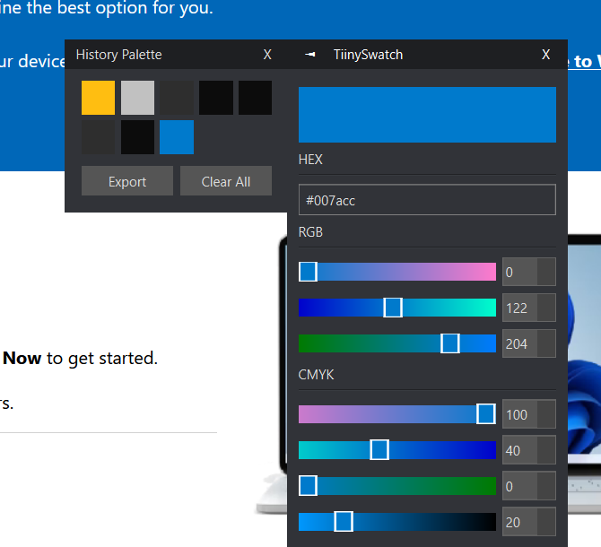

# Usage and Shortcuts



TiinySwatch will appear in your system tray as a single colored block. Left clicking the tray icon pulls up a color picker menu. Right clicking the tray icon pulls up the settings, where you can set keybinds. The default settings are as follows:
```
Clipboard Format: Hexadecimal
Screen Capture Keybind: f2
Toggle Color Picker Keybind: f3
Toggle Palette Keybind: f4
Auto Copy To Clipboard: True
```
Additionally, you can perform the following actions:
 - Pressing Ctrl+S while on the color picker will save the current color to the history palette.
 - Pressing delete on a color in the palette will remove it.
 - You can navigate through the color palette by clicking or using the arrow keys.
 - Clicking on the RGB or HSV tabs in the color picker will allow you to change the color format.
 - The export button in the history palette exports to Paint.NET's palette format.
# Building From Source

The following runs the program using python:
```
pip install -r requirements.txt
python app.py
```

The following builds the program to your local machine in EXE format (Windows only):
```
pip install -r requirements.txt
pyinstaller TiinySwatch.spec
```
