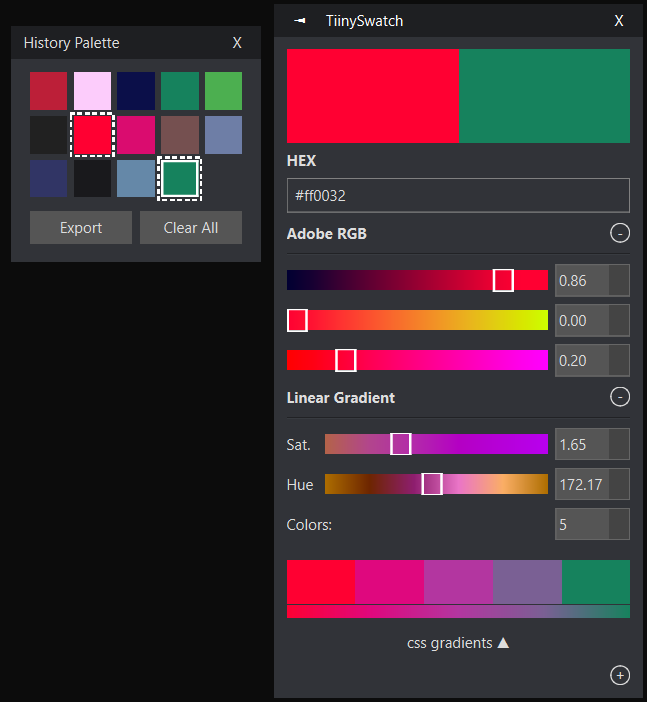

# Installation

For the time being, this repository comes with an msi installer (TiinySwatch-1.0-win64.msi) in the root directory. Run this installer to install TiinySwatch. Once installed, a shortcut will automatically be added to your Desktop.

# Usage and Shortcuts



TiinySwatch will appear in your system tray as a single colored block. Left clicking the tray icon pulls up a color picker menu. Right clicking the tray icon pulls up the settings, where you can set keybinds and other options. The default settings are as follows:
```
Clipboard Format: Hexadecimal
Screen Capture Keybind: f2
Toggle Color Picker Keybind: f3
Toggle Palette Keybind: f4
Auto Copy To Clipboard: True
```
Additionally, you can perform the following actions:
 - Pressing Ctrl+S while on the color picker will save the current colors to the history palette.
 - Pressing delete on a color in the palette or in the picker will remove it.
 - You can navigate through the color palette by clicking or using the arrow keys.
 - Clicking on the RGB or HSV tabs in the color picker will allow you to change the color format.
 - The export button in the history palette exports to Paint.NET's palette format.
 - Ctrl or shift clicking in the history palette allows you to select multiple colors for picking. Some tools, like "Linear Gradient", make use of multiple color selections.

# Building From Source

The following runs the program using python (Recommended version: 3.9):
```
pip install -r requirements.txt
python app.py
```